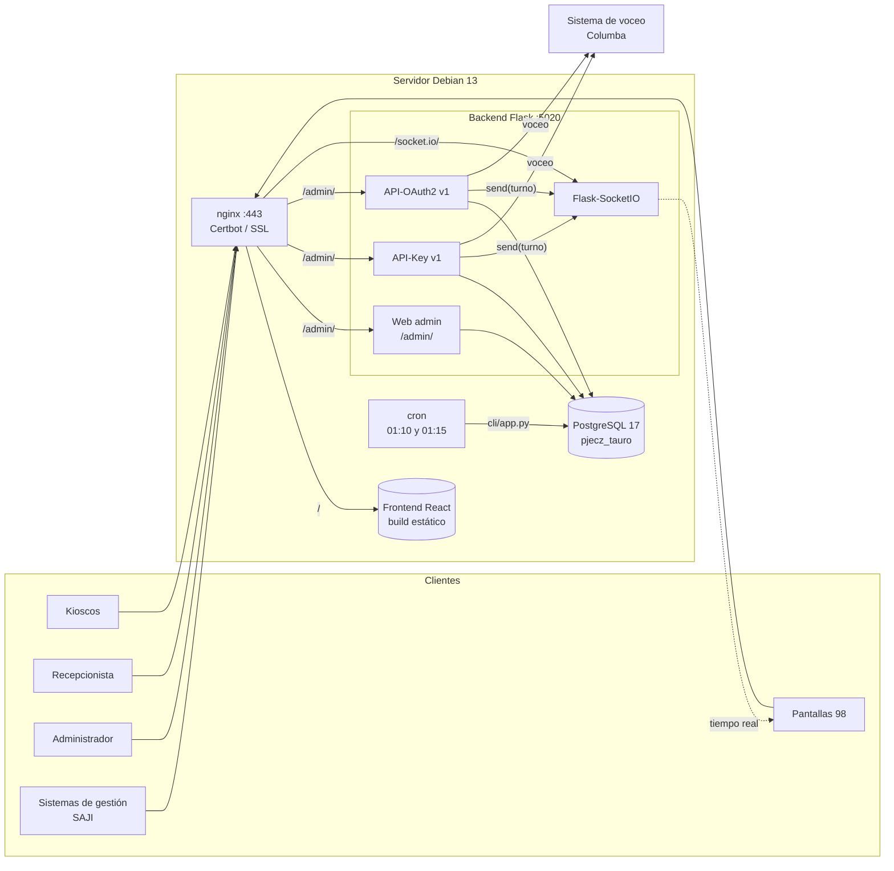
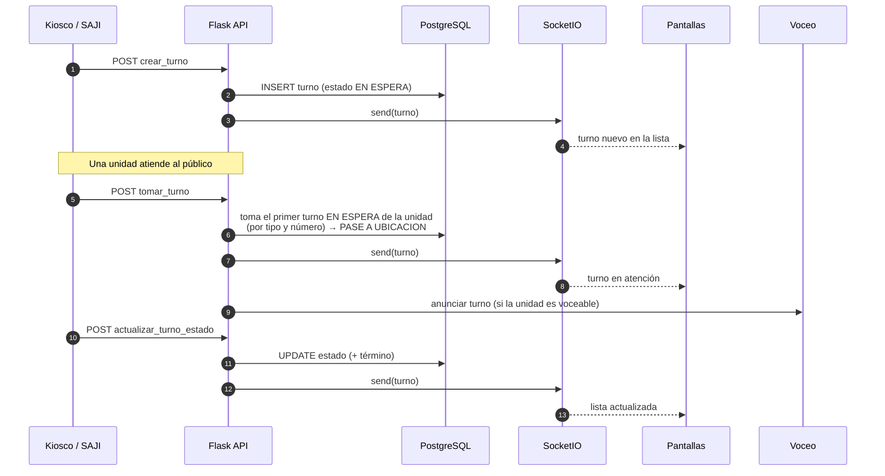
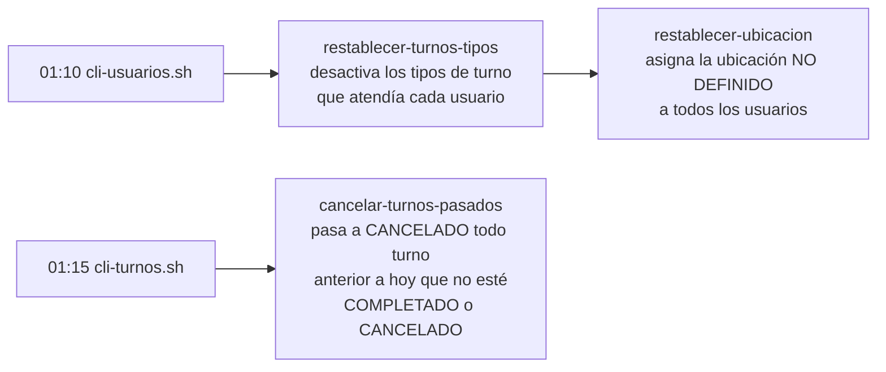

# 🏛️ Visión general y arquitectura

## ¿Qué es Tauro?

**PJECZ-Tauro** es el sistema de turnos de la Ciudad Judicial. Entró en producción el **2026-03-20**. Se compone de dos repositorios:

| Repositorio                | Rol                                                     | Tecnología                                        |
| -------------------------- | ------------------------------------------------------- | ------------------------------------------------- |
| `pjecz-tauro-flask` (este) | _Backend_: administración web, APIs y WebSocket         | Python 3.14, Flask, Flask-SocketIO, PostgreSQL 17 |
| `pjecz-tauro-reactjs`      | _Frontend_: pantallas de turnos y uso del recepcionista | React                                             |

### Quién consume el sistema

- **Dos pantallas de 98"** (Samsung) a los lados de las ventanillas de recepción de Oficialía de Partes. Muestran los turnos pendientes y en atención.
- **Dos kioscos** en la entrada de la Ciudad Judicial, donde el público genera su turno.
- **Sistemas de gestión** (p. ej. SAJI), que toman turnos y cambian su estado mediante la API-Key.
- **Recepcionistas**, que usan el _frontend_ autenticándose con OAuth2.
- **Administradores**, que usan la parte web (`/admin/`).
- **Sistema de voceo** ([pjecz-columba-cli-typer](https://github.com/ricval/pjecz-columba-cli-typer)), que anuncia por altavoz los turnos de las unidades marcadas como voceables.

## 🌐 Rutas públicas

| Entorno    | Dominio                       |
| ---------- | ----------------------------- |
| Producción | `https://turnos.saji.gob.mx`  |
| Desarrollo | `https://turnos.pjecz.gob.mx` |

| Ruta (`${DOMINIO}`)      | Destino                                                        |
| ------------------------ | -------------------------------------------------------------- |
| `/`                      | _Frontend_; si no hay sesión, muestra el formulario de entrada |
| `/admin/`                | _Backend_, parte administrativa                                |
| `/admin/api_key/v1/…`    | API para los sistemas de gestión (API-Key)                     |
| `/admin/api_oauth2/v1/…` | API para el _frontend_ (OAuth2/JWT)                            |
| `/socket.io/`            | WebSocket que actualiza las pantallas en tiempo real           |
| `/pantalla`              | Pantalla general de turnos                                     |
| `/pantalla/<unidad_id>`  | Pantalla de una sola unidad (p. ej. `/pantalla/2`)             |

> [!NOTE]
> En producción la aplicación se monta bajo el prefijo `PREFIX=/admin` (ver [configuración](04-instalacion-y-configuracion.md)). Por eso las APIs quedan en `/admin/api_key/v1/…`.

## 🧩 Arquitectura



### Componentes

| Componente            | Descripción                                                                                                                                                                                            |
| --------------------- | ------------------------------------------------------------------------------------------------------------------------------------------------------------------------------------------------------ |
| **nginx**             | Termina HTTPS (certificado con Certbot), sirve el _frontend_ estático y hace _proxy_ a Flask en `localhost:5020`. Configurado también para _upgrade_ de WebSocket.                                     |
| **Flask**             | Una sola aplicación (`tauro.app:create_app`) con _blueprints_ por módulo. El arranque para WSGI está en [`appserver.py`](../appserver.py).                                                             |
| **Flask-SocketIO**    | Cada vez que se crea, toma o cambia un turno se emite el mensaje a las pantallas conectadas. También existe el evento `refresh_screens`, que fuerza recargar las pantallas desde el módulo _Sistemas_. |
| **PostgreSQL**        | Base `pjecz_tauro`. Todas las tablas heredan de `UniversalMixin` (estatus, creado, modificado).                                                                                                        |
| **CLI**               | Comandos con Click en [`cli/`](../cli), ejecutados por cron o a mano. Ver [operación](05-operacion-y-mantenimiento.md).                                                                                |
| **Servicio de voceo** | [`tauro/services/`](../tauro/services): `VocearTurnos` decide qué anunciar y `Voceador` envía el mensaje al sistema de voceo con su propia API-Key.                                                    |

## 🔄 Ciclo de vida de un turno



Cada operación hecha con una API-Key o con un usuario queda registrada en la tabla `bitacoras`. En la bitácora de la API-Key aparece el **nombre** de la llave, para saber qué sistema hizo cada cambio.

### Limpieza diaria



De este modo cada jornada empieza sin turnos pendientes del día anterior y sin usuarios asignados a una ventanilla ni a tipos de turno del día anterior.

## 🗂️ Estructura del repositorio

```
pjecz-tauro-flask/
├── appserver.py          # Punto de entrada WSGI (gunicorn / uvicorn)
├── config/               # settings.py (pydantic-settings) y gunicorn_config.py
├── tauro/
│   ├── app.py            # create_app(): registra extensiones y blueprints
│   ├── extensions.py     # database, socketio, login_manager, csrf…
│   ├── blueprints/       # Un paquete por módulo (models, views, forms, templates)
│   │   ├── api_key_v1/   #   API para sistemas de gestión
│   │   ├── api_oauth2_v1/#   API para el frontend
│   │   └── …
│   └── services/         # Voceo de turnos
├── cli/                  # Comandos Click (cmd_*.py, alimentar_*, respaldar_*)
├── lib/                  # Utilidades (cadenas, fechas, mixin universal…)
├── sql/                  # Scripts de migración manuales
├── scripts/              # Scripts shell para cron
├── tests/                # Pruebas y colección Bruno
└── docs/                 # Esta documentación
```
