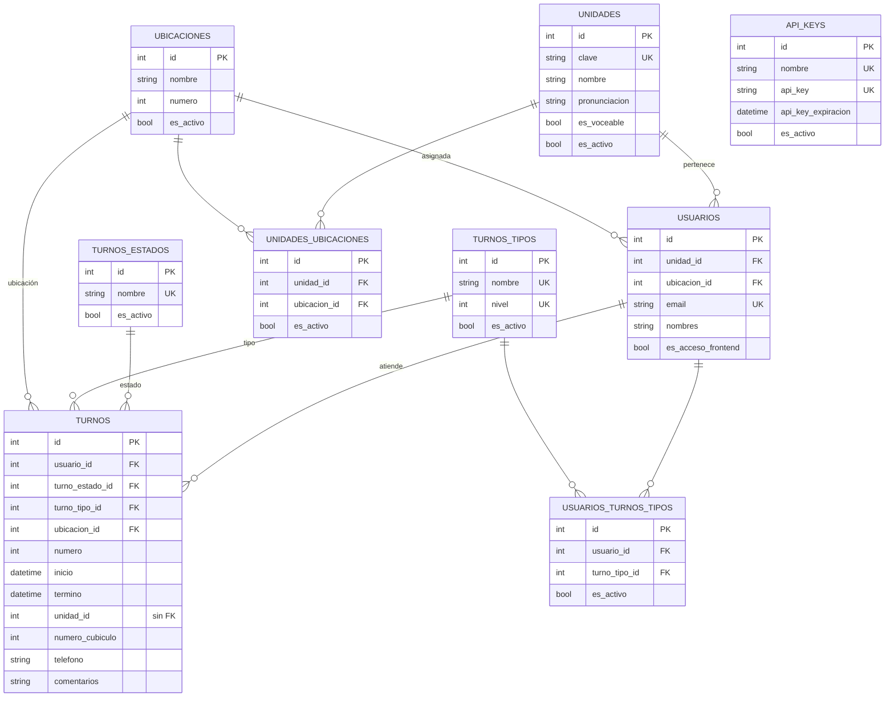
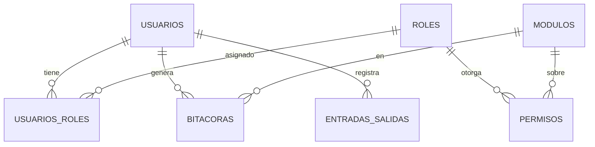

# 🗄️ Base de datos

Base **PostgreSQL 17**, nombre `pjecz_tauro`. Los modelos están en `tauro/blueprints/<módulo>/models.py` (SQLAlchemy 2.0).

## Columnas comunes (`UniversalMixin`)

Todas las tablas incluyen:

| Columna | Tipo | Descripción |
|---------|------|-------------|
| `creado` | datetime | Fecha de creación (por defecto `now()`) |
| `modificado` | datetime | Se actualiza en cada cambio |
| `estatus` | char(1) | `A` = activo, `B` = borrado (**borrado lógico**; los registros nunca se eliminan) |

Las tablas con `es_activo` tienen además un indicador funcional, aparte del borrado lógico.

## 🧭 Diagrama entidad-relación

Se muestran las tablas del dominio de turnos. Las tablas de seguridad y auditoría van agrupadas en la [sección siguiente](#-tablas-de-seguridad-y-auditoría).



> [!NOTE]
> `turnos.unidad_id` es un entero **sin clave foránea**: guarda la unidad a la que se dirige el turno, pero no es una relación fuerte. El código consulta `Unidad` por separado.
> `api_keys` no se relaciona con otras tablas; la llave se identifica por su `nombre` en las descripciones de la bitácora.

## 📋 Tablas del dominio de turnos

### `turnos`
Un turno generado para una persona que acude a una unidad.

- **`numero`**: consecutivo visible del turno.
- **`turno_estado_id`**: ciclo de vida. Los estados que usa el código incluyen `EN ESPERA` (al crearse), `PASE A UBICACION` (al ser tomado), `COMPLETADO` y `CANCELADO`.
- **`turno_tipo_id`**: prioridad/clase del turno (ver `turnos_tipos`).
- **`usuario_id`** y **`ubicacion_id`**: quién lo atiende y dónde. Al crear el turno la ubicación es `NO DEFINIDO` y se asigna al tomarlo.
- **`inicio`** / **`termino`**: marcas de tiempo de la atención.
- **`numero_cubiculo`**: cubículo indicado en pantalla (0 = sin cubículo).
- **`telefono`**, **`comentarios`**: datos opcionales capturados al crear el turno.

### `turnos_estados`
Catálogo de estados. Se alimenta con `cli/app.py db alimentar-turnos-estados`. El código depende de los nombres, así que **no los renombres**.

### `turnos_tipos`
Catálogo de tipos de turno. `nivel` es único y define el orden de prioridad.

### `unidades`
Áreas del juzgado que atienden al público.

- `clave`: identificador corto único.
- `pronunciacion`: texto que se usa para el voceo.
- `es_voceable`: si es `false`, sus turnos no se anuncian por altavoz.

### `ubicaciones`
Ventanillas o cubículos físicos (`numero` es opcional). Existe una ubicación especial **`NO DEFINIDO`** que usan los turnos recién creados y el CLI de restablecimiento.

### `unidades_ubicaciones`
Tabla puente muchos-a-muchos: qué ubicaciones puede usar cada unidad.

### `usuarios_turnos_tipos`
Tabla puente: qué tipos de turno atiende cada usuario. Se desactiva cada madrugada (ver [operación](05-operacion-y-mantenimiento.md)).

### `api_keys`
Llaves de acceso para los sistemas de gestión.

- `nombre`: descripción del sistema dueño de la llave.
- `api_key_expiracion`: fecha límite; por defecto 90 días al generarla con el CLI.
- `es_activo`: nace en `false` y debe habilitarse.

> [!CAUTION]
> El valor de `api_key` es una credencial. No lo copies a documentos, *tickets* ni al repositorio.

## 🔐 Tablas de seguridad y auditoría

Son comunes a los sistemas PJECZ. No se detallan aquí; solo su relación general:

| Tabla | Propósito |
|-------|-----------|
| `usuarios` | Cuentas que entran por web o *frontend* |
| `roles` | Agrupaciones de permisos |
| `usuarios_roles` | Roles asignados a cada usuario |
| `modulos` | Módulos del sistema (alimentan el menú) |
| `permisos` | Nivel de acceso de un rol sobre un módulo |
| `sistemas` | Información/acciones sobre el sistema (p. ej. refrescar pantallas) |
| `entradas_salidas` | Registro de inicios y cierres de sesión |
| `bitacoras` | Auditoría: qué usuario hizo qué en qué módulo |



## 🌱 Datos iniciales

Los catálogos se cargan desde CSV (ignorados por git) con los comandos `alimentar_*` y se respaldan con `respaldar_*` en [`cli/commands/`](../cli/commands). Consulta [operación](05-operacion-y-mantenimiento.md#-comandos-cli).

## 🛠️ Migraciones

No se usa Alembic. Los cambios de esquema se aplican con scripts manuales en [`sql/`](../sql), nombrados `vX.Y.Z-NN-descripcion.sql`. Ejemplo: `v1.4.0-01-add-campo-nombre-api_key.sql`.

## ♻️ Reiniciar los turnos (solo pruebas)

> [!CAUTION]
> **Nunca lo ejecutes en producción.** Borra todos los turnos, bitácoras y registros de sesión.

```sql
TRUNCATE TABLE turnos RESTART IDENTITY;
TRUNCATE TABLE bitacoras RESTART IDENTITY;
TRUNCATE TABLE entradas_salidas RESTART IDENTITY;
```

Con `ENVIRONMENT=production` la aplicación evita reiniciar la base de datos.
