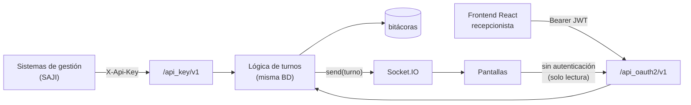

# 🔌 APIs

El sistema expone dos APIs REST (Flask-RESTful) con las mismas operaciones de negocio, y un canal WebSocket. Mapa visual: [diagrama-operación.html](diagrama-operación.html).

| Documento | Para quién |
|-----------|------------|
| 🔑 [**API-Key v1**](03-01-api-key.md) | Sistemas de gestión (p. ej. SAJI) |
| 🪪 [**API-OAuth2 v1**](03-02-api-oauth2.md) | *Frontend* React y pantallas públicas |



| | [API-Key](03-01-api-key.md) | [API-OAuth2](03-02-api-oauth2.md) |
|--|---------|------------|
| Prefijo | `/api_key/v1` | `/api_oauth2/v1` |
| Quién la usa | Sistemas de gestión | *Frontend* React |
| Autenticación | Cabecera `X-Api-Key: <llave>` | `Authorization: Bearer <token>`, obtenido en `/token` |
| Identidad del usuario | Va en el cuerpo: `usuario_id` | Sale del token (`sub` = email); **no** se envía |
| Vigencia | Hasta `api_key_expiracion` y mientras `es_activo` | El JWT dura **1 hora** (ver nota) |

> [!NOTE]
> En producción añade el prefijo `/admin`: `https://<dominio>/admin/api_key/v1/…`.

> [!WARNING]
> `/token` responde `expires_in` con `TOKEN_OAUTH2_EXPIRES_IN_SEG` (1 día por defecto), pero el JWT se firma con `exp` fijo de **1 hora** en [`autenticar.py`](../tauro/blueprints/api_oauth2_v1/endpoints/autenticar.py). Para el *frontend*, confía en la hora real y no en `expires_in`.

## Endpoints de un vistazo

Cada celda indica el método HTTP; el detalle de cada uno está en el documento de su API.

| Operación | Ruta | API-Key | OAuth2 |
|-----------|------|:-------:|:------:|
| Obtener token | `/token` | — | [`POST`](03-02-api-oauth2.md#post-token) |
| Validar token | `/validar_token` | — | [`GET`](03-02-api-oauth2.md#get-validar_token) |
| Probar conexión | `/test_conexion` | [`GET`](03-01-api-key.md#get-test_conexion) | — |
| Crear turno de prueba | `/test_crear_turno` | [`POST`](03-01-api-key.md#post-test_crear_turno) | — |
| Crear turno | `/crear_turno` | [`POST`](03-01-api-key.md#post-crear_turno) | [`POST`](03-02-api-oauth2.md#post-crear_turno) |
| Tomar turno | `/tomar_turno` | [`POST`](03-01-api-key.md#post-tomar_turno) | [`GET`](03-02-api-oauth2.md#get-tomar_turno) |
| Cambiar estado de un turno | `/actualizar_turno_estado` | [`POST`](03-01-api-key.md#post-actualizar_turno_estado) | [`POST`](03-02-api-oauth2.md#post-actualizar_turno_estado) |
| Actualizar usuario | `/actualizar_usuario` | [`POST`](03-01-api-key.md#post-actualizar_usuario) | [`POST`](03-02-api-oauth2.md#post-actualizar_usuario) |
| Consultar configuración del usuario | `/consultar_configuracion_usuario` | [`POST`](03-01-api-key.md#post-consultar_configuracion_usuario) | [`GET`](03-02-api-oauth2.md#get-consultar_configuracion_usuario) |
| Consultar turnos (todos) | `/consultar_turnos` | — | [`GET`](03-02-api-oauth2.md#get-consultar_turnos) 🔓 |
| Consultar turnos de una unidad | `/consultar_turnos/<unidad_id>` | — | [`GET`](03-02-api-oauth2.md#get-consultar_turnosunidad_id) 🔓 |
| Catálogos: estados, tipos, unidades, ubicaciones | `/consultar_*` | [`GET`](03-01-api-key.md#catálogos-get) | [`GET`](03-02-api-oauth2.md#catálogos-get) |

🔓 = **sin autenticación**, a propósito: las pantallas públicas solo leen.

> [!IMPORTANT]
> Cuidado con la diferencia entre APIs: para el mismo concepto, **API-Key** usa `POST` con `usuario_id` y **OAuth2** usa `GET` sin cuerpo en `tomar_turno` y `consultar_configuracion_usuario`.

## Convenciones

- Cuerpo y respuestas en **JSON** (`Content-Type: application/json`).
- **Todas** las respuestas llevan la misma envoltura:

  ```json
  { "success": true, "message": "Texto legible", "data": { } }
  ```

  `data` es un objeto o una lista, y puede faltar (`null`) cuando `success` es `false`.
- Los errores de negocio (usuario no encontrado, sin turnos, etc.) responden **HTTP 200 con `success: false`** y el motivo en `message`. Revisa siempre `success`, no solo el código HTTP.
- Errores de autenticación:

  | HTTP | Cuándo |
  |:----:|--------|
  | 401 | API-Key ausente o inválida · token ausente o inválido |
  | 403 | API-Key deshabilitada (`es_activo = false`) |
  | 200 | Token **expirado** (`success: false`, "El token ha expirado!") |

## Objetos comunes

Aparecen dentro de `data` en varias respuestas de ambas APIs.

| Objeto | Campos |
|--------|--------|
| **Turno** | `turno_id`, `turno_numero`, `turno_fecha` (ISO 8601), `turno_numero_cubiculo` (0 = sin cubículo), `turno_telefono`, `turno_comentarios`, `turno_estado` {`id`,`nombre`}, `turno_tipo` {`id`,`nombre`,`nivel`}, `ubicacion` {`id`,`nombre`,`numero`}, `unidad` {`id`,`clave`,`nombre`} |
| **Configuración de usuario** | `usuario_nombre_completo`, `unidad`, `ubicacion`, `rol` {`id`,`nombre`}, `turnos_tipos` (lista de tipos activos), `ultimo_turno` (Turno o `null`) |

## 📡 WebSocket (Socket.IO)

Servido por la misma aplicación en `/socket.io/`. Las pantallas del *frontend* se conectan y reciben:

| Mensaje | Cuándo se emite | Contenido |
|---------|-----------------|-----------|
| `message` (`socketio.send`) | Al crear, tomar o actualizar un turno (API o web) | La respuesta completa del turno: `{ success, message, data: Turno }` |
| `refresh_screens` | Desde el módulo *Sistemas* del administrador | Orden de recargar las pantallas |

> [!WARNING]
> Con Socket.IO usa **un solo *worker*** de gunicorn (`--workers 1 --threads N`); con varios procesos los mensajes no llegan a todos los clientes. Además `cors_allowed_origins="*"` permite conectarse desde cualquier origen.

El archivo [`tests/leer_socketio.html`](../tests/leer_socketio.html) sirve para escuchar el canal durante pruebas.

## 🔑 Gestión de API-Keys

Ver [Gestión de llaves](03-01-api-key.md#-gestión-de-llaves).
