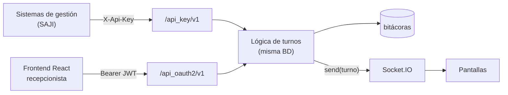

# 🔌 APIs

El sistema expone dos APIs REST (Flask-RESTful) con las mismas operaciones de negocio, y un canal WebSocket. Mapa visual: [diagrama-operación.html](diagrama-operación.html).



| | API-Key | API-OAuth2 |
|--|---------|------------|
| Prefijo | `/api_key/v1` | `/api_oauth2/v1` |
| Quién la usa | Sistemas de gestión | *Frontend* React |
| Autenticación | Cabecera `X-Api-Key` | JWT HS256 en `Authorization: Bearer …`, obtenido en `/token` |
| Identidad del usuario | Se indica en la petición (p. ej. su email) | Sale del token (`sub` = email) |
| Duración | Hasta `api_key_expiracion` | `TOKEN_OAUTH2_EXPIRES_IN_SEG` (1 día por defecto) |

> [!NOTE]
> En producción añade el prefijo `/admin`: `https://<dominio>/admin/api_key/v1/…`.

## Endpoints

| Operación | Ruta | API-Key | OAuth2 |
|-----------|------|:------:|:------:|
| Obtener token | `/token` | — | ✅ |
| Validar token | `/validar_token` | — | ✅ |
| Probar conexión | `/test_conexion` | ✅ | — |
| Crear turno de prueba | `/test_crear_turno` | ✅ | — |
| Crear turno | `/crear_turno` | ✅ | ✅ |
| Tomar turno | `/tomar_turno` | ✅ | ✅ |
| Cambiar estado de un turno | `/actualizar_turno_estado` | ✅ | ✅ |
| Actualizar usuario | `/actualizar_usuario` | ✅ | ✅ |
| Consultar turnos (todos) | `/consultar_turnos` | — | ✅ |
| Consultar turnos de una unidad | `/consultar_turnos/<unidad_id>` | — | ✅ |
| Consultar configuración del usuario | `/consultar_configuracion_usuario` | ✅ | ✅ |
| Consultar estados de turno | `/consultar_turnos_estados` | ✅ | ✅ |
| Consultar tipos de turno | `/consultar_turnos_tipos` | ✅ | ✅ |
| Consultar unidades | `/consultar_unidades` | ✅ | ✅ |
| Consultar ubicaciones | `/consultar_ubicaciones` | ✅ | ✅ |

> [!TIP]
> El método HTTP (GET/POST) varía entre endpoints y entre las dos APIs. Verifica el método exacto y el esquema de cada petición en `tauro/blueprints/api_key_v1/endpoints/` y `schemas.py`, o usa la colección [Bruno](../tests/bruno) incluida en el repositorio.

### Reglas de negocio relevantes

- **Crear turno**: nace en estado `EN ESPERA` y con la ubicación `NO DEFINIDO`.
- **Tomar turno**: busca el primer turno `EN ESPERA` de la **unidad del usuario**, entre los tipos que ese usuario tiene activos, ordenado por tipo y luego por número. Lo pasa a `PASE A UBICACION`, le asigna usuario y ubicación y registra `inicio`. Si no hay ninguno responde `success=false` ("No hay turnos en espera").
- **Voceo**: al tomar un turno o cambiar su estado se envía el anuncio al sistema de voceo, solo si la unidad es `es_voceable`.
- **Bitácora**: toda operación queda registrada; si vino por API-Key se incluye el nombre de la llave.

### Formato de respuesta

Las respuestas siguen un esquema uniforme (Pydantic, [`api_v1/schemas.py`](../tauro/blueprints/api_v1/schemas.py)):

```json
{
  "success": true,
  "message": "Turno 12 tomado por Nombre Apellido",
  "data": { "turno_id": 0, "turno_numero": 12, "turno_estado": { "id": 0, "nombre": "…" } }
}
```

## 📡 WebSocket (Socket.IO)

Servido por la misma aplicación en `/socket.io/`. Las pantallas del *frontend* se conectan y reciben:

| Mensaje | Cuándo se emite | Contenido |
|---------|-----------------|-----------|
| `message` (`socketio.send`) | Al crear, tomar o actualizar un turno (API o web) | El turno completo (`OneTurnoOut`) |
| `refresh_screens` | Desde el módulo *Sistemas* del administrador | Orden de recargar las pantallas |

> [!WARNING]
> Con Socket.IO usa **un solo *worker*** de gunicorn (`--workers 1 --threads N`); con varios procesos los mensajes no llegan a todos los clientes.

El archivo [`tests/leer_socketio.html`](../tests/leer_socketio.html) sirve para escuchar el canal durante pruebas.

## 🔑 Gestión de API-Keys

Se administran desde el módulo **API Keys** del sitio o desde el CLI:

```bash
uv run python cli/app.py usuarios nueva-api-key correo@pjecz.gob.mx --dias 90
uv run python cli/app.py usuarios mostrar-api-key correo@pjecz.gob.mx
```

Requieren `PYTHONPATH` apuntando a la raíz del proyecto (ver [operación](05-operacion-y-mantenimiento.md)).
