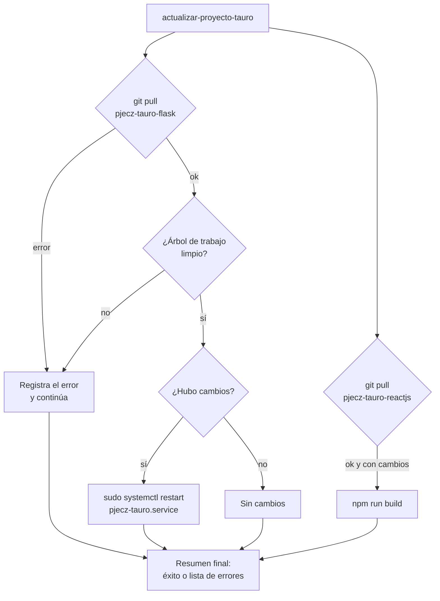

# 🔧 Operación y mantenimiento

## 🖥️ Servidores

| | Producción | Desarrollo |
|--|-----------|------------|
| Nombre | *villa* | *carranza* |
| Dominio | `turnos.saji.gob.mx` | `turnos.pjecz.gob.mx` |
| Ubicación | Oficialía Mayor | — |
| Hardware | Dell PowerEdge R430 | — |
| Sistema | Debian 13 | Debian 13 |
| Usuario de la aplicación | `pjecz-tauro` (solo llave SSH) | `pjecz-tauro` |

Directorios en el servidor (usuario `pjecz-tauro`):

| Ruta | Contenido |
|------|-----------|
| `~/github/<org>/pjecz-tauro-flask` | *Backend* |
| `~/github/<org>/pjecz-tauro-reactjs` | *Frontend* |
| `~/respaldos_bd/` | Respaldos de la base de datos (se conservan 7 días) |
| `~/logs/` | Registros de las tareas programadas |
| `~/.local/bin/` | Scripts `cli-turnos.sh`, `cli-usuarios.sh`, `respaldar-bd.sh`… |
| `~/.bashrc.d/` | Pantalla de bienvenida y función de actualización |

> [!NOTE]
> Las IPs, contraseñas y llaves de los servidores se documentan en el gestor interno de contraseñas/inventario, **no** en este repositorio.

## 🚀 Despliegue

Flujo: *pull request* → integrar en `dev` → ejecutar en el servidor:

```bash
actualizar-proyecto-tauro
```



La función (definida en [20-actualizar-proyecto.sh](20-actualizar-proyecto.sh)) detiene el proceso de ese proyecto si hay cambios locales sin confirmar, para no desplegar un servidor "sucio".

### Alias y pantalla de bienvenida

Al entrar por SSH se muestra la pantalla de [90-pantalla-bienvenida.sh](90-pantalla-bienvenida.sh) con los comandos disponibles. Se vuelve a mostrar con `comandos`.

| Comando | Qué hace |
|---------|----------|
| `actualizar-proyecto-tauro` | Descarga cambios de GitHub, reinicia el *backend* y reconstruye el *frontend* |
| `cargar-tauro-flask` | Va al proyecto y activa su entorno virtual y `.env` |
| `cargar-tauro-reactjs` | Va al directorio del *frontend* |
| `comandos` | Muestra de nuevo la pantalla de bienvenida |
| `respaldar-bd.sh` | Respaldo de la base en `~/respaldos_bd/` |
| `restaurar-bd-desde-respaldo.sh <archivo>` | Restaura la base desde un respaldo |
| `cli-turnos` | Cancela turnos pendientes de días anteriores |
| `cli-usuarios` | Restablece asignaciones de los usuarios |

## ⏰ Tareas programadas (cron)

Se editan con `crontab -e` y se consultan con `crontab -l`.

```cron
# Restablece asignaciones de usuarios (ubicación y tipos de turno), 01:10
10 01 * * * /home/pjecz-tauro/.local/bin/cli-usuarios.sh >> /home/pjecz-tauro/logs/cli-usuarios.log 2>&1

# Cancela los turnos pasados no atendidos, 01:15
15 01 * * * /home/pjecz-tauro/.local/bin/cli-turnos.sh >> /home/pjecz-tauro/logs/cli-turnos.log 2>&1
```

Además hay una tarea de respaldo de la base de datos con `respaldar-bd.sh`.

## 💻 Comandos CLI

Ejecuta desde la raíz del proyecto, con `PYTHONPATH` apuntando a ella y el entorno virtual activo:

```bash
export PYTHONPATH=$(pwd)
uv run python cli/app.py --help
```

| Grupo | Comando | Descripción |
|-------|---------|-------------|
| `turnos` | `cancelar-turnos-pasados` | Pasa a `CANCELADO` los turnos anteriores a hoy que no estén `COMPLETADO` ni `CANCELADO` |
| `usuarios` | `restablecer-turnos-tipos` | Desactiva los tipos de turno que atiende cada usuario |
| `usuarios` | `restablecer-ubicacion` | Asigna la ubicación `NO DEFINIDO` a todos los usuarios |
| `usuarios` | `nueva-api-key <email> [--dias 90]` | Genera una API-Key |
| `usuarios` | `mostrar-api-key <email>` | Muestra la API-Key de un usuario |
| `usuarios` | `nueva-contrasena <email>` | Cambia la contraseña |
| `db` | `inicializar`, `alimentar-*`, `respaldar-*` | Crea tablas y carga/respalda catálogos |

> [!WARNING]
> `mostrar-api-key` y `nueva-api-key` imprimen una credencial en la terminal. No dejes esa salida en archivos de registro ni la compartas por chat.

## 💾 Respaldos y restauración

- El script `respaldar-bd.sh` genera respaldos en `~/respaldos_bd/` (retención de **7 días**) y corre por cron.
- Para restablecer la base a un día concreto:

  ```bash
  restaurar-bd-desde-respaldo.sh <archivo_de_respaldo.backup>
  ```

> [!CAUTION]
> Restaurar **reemplaza** los datos actuales. Confirma el archivo y avisa a Oficialía de Partes antes de hacerlo en producción.

## 🩺 Diagnóstico rápido

| Síntoma | Qué revisar |
|---------|-------------|
| El sitio no responde | `sudo systemctl status pjecz-tauro` y `sudo journalctl -u pjecz-tauro -n 100` |
| 502 en nginx | ¿Está arriba el servicio en el puerto 5020? `sudo nginx -t` |
| Las pantallas no se actualizan | WebSocket: bloque `/socket.io/` de nginx y un solo *worker* de gunicorn |
| Hay turnos de ayer en pantalla | Log `~/logs/cli-turnos.log` y que el cron esté activo |
| Un recepcionista no ve turnos | Sus tipos de turno se desactivan cada madrugada; debe volver a activarlos |
| El sistema de gestión recibe 401 | API-Key expirada (`api_key_expiracion`) o inactiva (`es_activo`) |
| Falla el voceo | `VOCEADOR_API_KEY(_URL)` y que la unidad tenga `es_voceable` |

## 📝 Notas de las copias en esta carpeta

- `docs/cli-usuarios.sh` llama a `restablecer-ventanilla`, que **ya no existe** en el CLI; el comando vigente es `restablecer-ubicacion` (como en [`scripts/cli-usuarios.sh`](../scripts/cli-usuarios.sh)). Si reinstalas desde esa copia, el cron fallará en el segundo paso.
- Las rutas de los scripts mezclan `github/PJECZ/` y `github/pjecz/`. En Linux distingue mayúsculas, así que confirma cuál es la real en cada servidor.
- [`pjecz-tauro.service`](pjecz-tauro.service) usa `flask run` (modo desarrollo).
